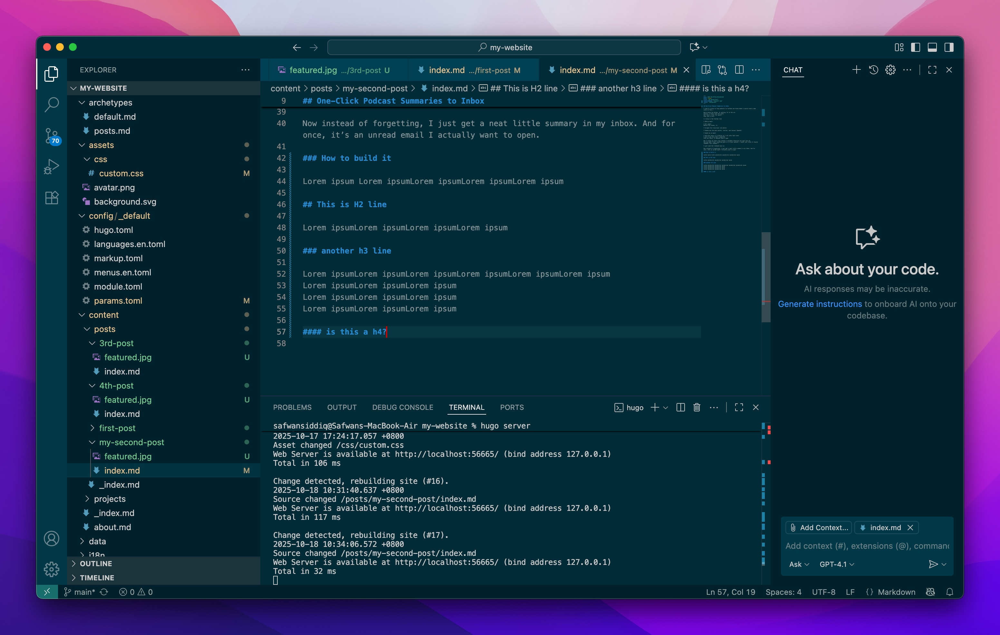

## One-Click Podcast Summaries to Inbox

I used to listen to long podcasts on YouTube and think:“Wow… I should really take notes on this.”

While doing the dishes. Or walking. Or in the car.
Spoiler: I never took the notes.
So I built a tool for myself.
It’s just a form:

→ I drop in the YouTube link

→ Add my email

→ Hit submit
Behind the scenes, it:

– Scrapes the transcript (via Apify)

– Summarizes the main points, stories, and lessons (OpenAI)

– Sends me an email

– And also saves it to Notion so I can refer back later
I use it way more than I expected.
It’s not fancy. It doesn’t have a name.

But it helps me learn from content I would’ve otherwise let wash over me.
And now when I hear something good in a 2-hour podcast, I don’t just think “I should remember this someday.”

I just send the link—and move on.

Now instead of forgetting, I just get a neat little summary in my inbox. And for once, it’s an unread email I actually want to open.

### How to build it

Lorem ipsum Lorem ipsumLorem ipsumLorem ipsumLorem ipsum

## This is H2 line

Lorem ipsumLorem ipsumLorem ipsumLorem ipsum

### another h3 line

Lorem ipsumLorem ipsumLorem ipsumLorem ipsumLorem ipsumLorem ipsum
Lorem ipsumLorem ipsumLorem ipsum
Lorem ipsumLorem ipsumLorem ipsum
Lorem ipsumLorem ipsumLorem ipsum

#### is this a h4?
