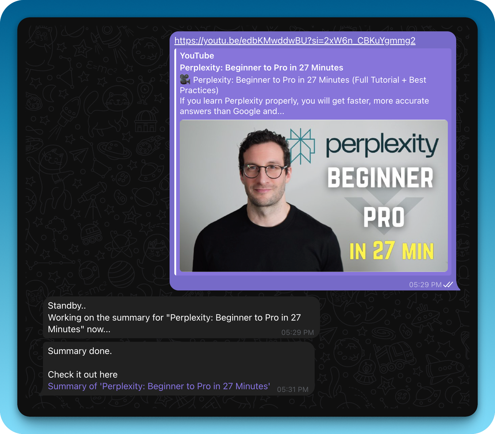
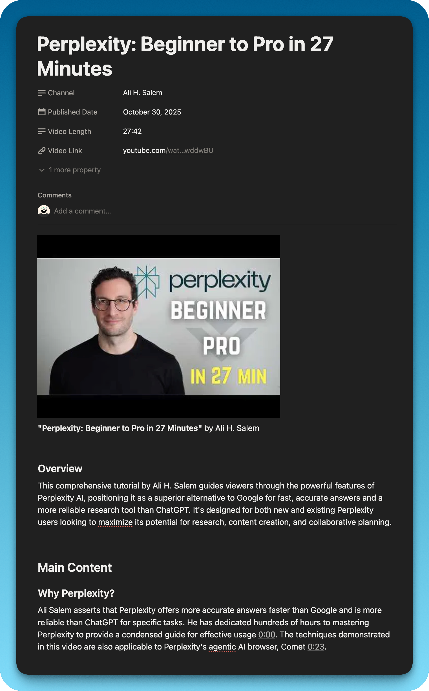

## Here is How I Went From Failed Attempts to a Working AI Workflow
I watch a lot of  YouTube. Tutorials on automation, podcasts with founders, educational deep-dives on topics I'm curious about. The problem? I'd watch something brilliant, think "I need to remember this," and then... forget it all two days later.

I needed a second brain for YouTube — something that could automatically capture the insights, organize them with timestamps, and save them to my Notion workspace where I could actually reference them later. So I set out to build exactly that: a  Telegram bot that turns any YouTube link into comprehensive, timestamped notes.

Spoiler: It took way more attempts than I expected. Here's the full story of how I went from complete failures to a workflow that actually works.

### The Vision: What I Wanted to Build
The concept was simple:

1. Send a YouTube link to a Telegram bot

2. Get back detailed notes with clickable timestamps, key takeaways, and curated resources

3. Have everything automatically saved to a Notion page

The tools I chose:

* n8n for workflow automation (self-hosted on Hostinger)

* OpenRouter for access to Claude 4.5 Sonnet and other AI models

* RapidAPI for fetching YouTube transcripts and metadata

* Telegram as my interface

* Notion as my knowledge repository

Simple enough, right? Well, not exactly.

## Part 1: The First (Failed) Attempts at Getting a Transcript
My first thought was the "easy" approach: just scrape the transcript from the web. I'd used the HTTP Request node in n8n before, so I figured I could point it at a transcript website like youtubetranscripts.com, feed it the YouTube URL, and extract the text.

The reality? I got back this monstrosity:

```
<!DOCTYPE html>
<html lang="en">
<head>
    <meta charset="UTF-8">
    <title>YouTube Transcript</title>
    <style>
        body { font-family: Arial, sans-serif; }
        .transcript { ... }
    </style>
</head>
...
```
Pages and pages of HTML, CSS, JavaScript—everything except a clean transcript. I tried different nodes, different websites, different approaches. Nothing worked. I was drowning in markup.

💡 **Lesson #1**: Web scraping consumer-facing websites is brittle and unreliable. The structure can change at any moment, and you're fighting against page layouts designed for humans, not machines. I needed something more robust.

## Part 2: The "Perplexity" Pivot - Letting AI Do the Heavy Lifting
Then I had what I thought was a brilliant idea: what if I just let the AI find the transcript for me? Tools like Perplexity can browse the web and extract information. I had access to web search tools like Tavily and Brave Search through n8n. Why not give my AI Agent one of those tools and let it handle the messy work?

I installed the Tavily node, connected it to my AI Agent, and updated my prompt:

```
When given a YouTube video link, use web search to find and retrieve the video's transcript, then analyze it...
I sent a test YouTube URL through the workflow.
```

The error:

```
{
  "errorMessage": "Bad request - please check your parameters",
  "errorDescription": "Query cannot consist only of site: operators. Please provide search terms."
}
```

The problem? The AI was trying to pass the raw YouTube URL directly to Tavily as a search query. But Tavily expected actual search terms, not a URL. I needed to either pre-process the URL into a proper search query or find a completely different approach.

I tried switching to different models (since Perplexity Sonar didn't support tool use), tweaked the prompt, adjusted how Tavily was configured. Nothing worked consistently.

💡 **Lesson #2**: AI tools aren't magic. You can't just give an AI a hammer and expect it to build a house. You need to understand how the tool works and structure your inputs appropriately. The AI is powerful, but it still needs guidance.

## Part 3: The API Breakthrough - Finding the Right Tool
Frustrated with all the workarounds, I went back to basics: just use an API specifically built for this task.

A quick search on RapidAPI led me to the YouTube Transcripts API. Finally—a dedicated endpoint that returns clean, structured JSON with the transcript text, timestamps, and duration.

I set up the HTTP Request node with the proper cURL parameters:

```
GET https://youtube-transcripts.p.rapidapi.com/youtube/transcript
?url={{ videoUrl }}
&videoId={{ videoId }}
&chunkSize=100
&text=false
&lang=en
```
Headers:

```
x-rapidapi-host: youtube-transcripts.p.rapidapi.com
x-rapidapi-key: YOUR_API_KEY
```

And for the first time... it worked. I got back beautiful, clean JSON:

```
{
  "lang": "en",
  "content": [
    {
      "text": "These are the five steps I always use when building AI agents...",
      "offset": 80,
      "duration": 23840
    },
    ...
  ]
}
```
With this reliable data source, I could finally build the core workflow:

1. Telegram Trigger → Receives YouTube link

2. IF Node → Validates it contains "youtu"

3. Code Node → Extracts video ID from URL

4. HTTP Request → Calls RapidAPI for transcript

5. Code Node → Formats transcript with timestamps

6. AI Agent → Analyzes and creates notes

7. Notion Node → Saves the result

8. Telegram Reply → Sends confirmation with Notion link

💡 **Lesson #3**: Use APIs whenever possible. They provide structured, predictable data. They're maintained by people who care about uptime. They're the foundation of robust automation.

## Part 4: From Generic Summaries to Detailed Notes
Now that I had the transcript, I needed the AI to actually do something useful with it. My first attempt was a simple prompt:

Analyze this YouTube transcript and create a summary.
The result? A generic, high-level overview. Something like:

"This video discusses five steps for building AI agents. The speaker covers foundations, identifying opportunities, process mapping, workflows vs agents, and guardrails."

Technically accurate, but completely useless. I didn't need a book report—I needed notes. The kind of notes I'd take if I watched the video myself.

### The Great Prompt Engineering Journey
This is where I spent most of my time. Here's what I learned through iteration:

**Change #1**: Set the Role and Perspective

Instead of "summarize this," I changed the opening to:

```
You are an expert note-taker who creates comprehensive, detailed notes from video transcripts. Your goal is to capture the substance, nuance, and creator's voice as if someone watched the entire video and wrote everything down.
```
Better. The AI started writing more like a human taking notes.

**Change #2**: Content Type Detection

I realized that a tutorial needs different formatting than a podcast. So I added:

```
Detect the Content Type:
- Tutorial/How-to: Focus on step-by-step instructions and implementation
- Podcast/Interview: Extract stories, insights, and quotes
- Educational: Capture concepts, explanations, and frameworks
```
This made the AI adapt its structure to the type of content.

**Change #3**: Clickable Timestamps

This was a game-changer. I wanted timestamps that I could click to jump to that exact moment in the video. The format:

```
[2:30](https://www.youtube.com/watch?v=VIDEO_ID&t=150s)
```
I added to the prompt:

```
Use clickable timestamps frequently. Format: [MM:SS](videoURL&t=XXXs) where you convert MM:SS to seconds.
Example: [2:30](videoURL&t=150s)
```
**The Timestamp Hallucination Problem**

Then I hit a bizarre issue: the AI was making up timestamps. It would reference [2:29] for a quote that actually appeared at [15:30]. The timestamps looked plausible, but they were completely wrong.

The problem? The AI was trying to be helpful and was generating timestamps instead of using the actual ones from the transcript.

The fix required a heavy-handed addition to the prompt:

```
**CRITICAL TIMESTAMP RULES:**
- ONLY use timestamps that appear in the transcript above
- NEVER make up, estimate, or fabricate timestamps
- When referencing content, find where it actually appears in the transcript
- If you're unsure, look back at the transcript to find the real timestamp
```
This finally forced the AI to stick to reality.

**Change #4**: Curated Resources via Tavily

Since I still had the Tavily search tool connected, I added:

```
### Curated Resources for Further Learning
Using web search, find and recommend 5-7 high-quality resources related to the main topics covered in this video.
Now the AI would search for related articles, books, and tools mentioned in the video and include them in the notes.
```

💡 **Lesson #4**: Your prompt is your program. The difference between mediocre AI output and genuinely useful output comes down to how specific, structured, and constraint-heavy your prompt is. Treat it like code.

## Part 5: The Metadata Layer
The notes were good, but something was missing: context. Who made this video? What was it called? How long was it?

I added a second RapidAPI call to fetch video metadata (title, channel, thumbnail, duration). Then I updated my prompt to start the notes with:

```

**"Video Title"** by Channel Name
```

This gave every note page a visual header, making it easier to recognize at a glance in Notion.

**The Duration Conversion Problem**
The metadata returned duration in HH:MM:SS format (like 1:23:45), but I needed it in total seconds for the AI to reference. So I wrote a quick Code node:

```
const duration = $json.duration;
const parts = duration.split(':').map(part => parseInt(part, 10));

let seconds = 0;
if (parts.length === 3) {
  seconds = (parts[0] * 3600) + (parts[1] * 60) + parts[2];
} else if (parts.length === 2) {
  seconds = (parts[0] * 60) + parts[1];
} else {
  seconds = parts[0];
}

return { ...$json, lengthSeconds: seconds };
```

Now the AI had access to the duration in a usable format.

## Part 6: Error Handling - Making It Production-Ready
What happens if a video has captions disabled? Or if RapidAPI goes down for maintenance? Initially, the workflow would just... fail silently.

I would just wait and wait and wait... and the results never comes.

I needed error handling to avoid this.

The Setup:

On both RapidAPI HTTP Request nodes, I enabled "Continue on Fail"

After each API call, I added an IF node to check for errors

If an error was detected, the workflow would:

Send me a Telegram message explaining the issue

Stop execution to avoid cascading failures

The error message looked like:

```
😞 **Captions Not Available**

Video: [YouTube URL]

❌ This video doesn't have public captions available or they're disabled by the creator.
```

💡 **Lesson #5**: A good workflow is a resilient workflow. Error handling, logging, and clear user feedback are what separate a personal hack from a tool you can actually rely on.

## Part 7: Choosing the Right AI Model
I experimented with several models on OpenRouter:

GPT-4o (fast but sometimes shallow)

Gemini 2.5 Pro (great for long videos, very affordable)

Claude 4.5 Sonnet (best overall for nuanced note-taking)

For this use case, Claude 4.5 Sonnet won. Here's why:
* 200K context window - Handles even 2+ hour video transcripts
* Superior reasoning - Captures nuance and preserves the creator's voice
* Excellent tool use - Works seamlessly with the Tavily search integration
* Natural writing style - The notes don't sound robotic

Cost per video averaged around **$0.08–$0.25** depending on length, which felt reasonable for the value I was getting.

## Part 8: The Final Workflow
Here's what the completed automation looks like:


```
Telegram Trigger
↓
IF: Contains "youtu"?
↓
Code: Extract Video ID
↓
HTTP Request: Get Transcript (RapidAPI)
↓
IF: Error? → Send Telegram Error → Stop
↓
Code: Clean Transcript (format with timestamps)
↓
HTTP Request: Get Metadata (RapidAPI)
↓
IF: Error? → Send Telegram Error → Stop
↓
Code: Convert Duration to Seconds
↓
Send Telegram: "Working on it..."
↓
AI Agent (Claude 4.5 Sonnet + Tavily Tool)
↓
Create Notion Page
↓
Log to Google Sheets
↓
Send Telegram: Markdown link to Notion page
```
The entire process takes 30–60 seconds from link to finished notes.

### What I Learned
1. Start simple, but expect to iterate. My first version was "send URL, get transcript, ask AI to summarize." The final version is far more sophisticated because I kept finding gaps.

2. APIs > scraping, always. The hours I wasted trying to scrape web pages could have been spent building features. APIs are worth the small cost.

3. Prompt engineering is 80% of the work. The difference between mediocre and excellent AI output comes down to how well you structure your instructions.

4. AI tools need guidance. You can't just throw a tool at an AI and expect magic. You need to understand how the tool works and design your prompts accordingly.

5. Error handling is what makes it real. A workflow that fails gracefully and tells you why is infinitely more valuable than one that just breaks.

6. The best way to learn is to build something you'll actually use. I built this because I genuinely wanted it. That kept me going through all the failed attempts.

## The Result
Now, whenever I watch a YouTube video worth remembering, I paste the link into Telegram. A minute later, I will receive a message on Telegram with a link.

 

And the link will point to a Notion page with:

* A thumbnail and title
* Comprehensive notes with the creator's voice preserved
* Clickable timestamps to jump to specific moments
* Key takeaways and insights
* Curated resources for deeper learning



It's transformed how I consume and retain information from YouTube. Instead of passively watching and forgetting, I'm actively building a knowledge base I can reference forever.

If you're thinking about building something similar, my advice: start messy, iterate relentlessly, and don't be afraid to scrap approaches that aren't working. The best automations are built through trial and error.

## Appendix: 
### The Final Prompt

Here's the complete prompt I use in the AI Agent node (cleaned up for readability):

```
You are an expert note-taker who creates comprehensive, detailed notes from video transcripts. Your goal is to capture the substance, nuance, and creator's voice.

---

VIDEO INFORMATION:
Title: {{ $json.title }}
Channel: {{ $json.author }}
Duration: {{ $json.lengthSeconds }} seconds
Video URL: {{ $json.videoUrl }}

FULL TRANSCRIPT WITH TIMESTAMPS:
{{ $json.transcript }}

---

CREATE DETAILED NOTES FOLLOWING THESE GUIDELINES:

**CRITICAL TIMESTAMP RULES:**
- ONLY use timestamps that appear in the transcript above
- NEVER make up, estimate, or fabricate timestamps
- Format: [MM:SS]({{ $json.videoUrl }}&t=XXXs)
- Convert MM:SS to seconds (e.g., 2:30 = 150 seconds)

START YOUR NOTES WITH:

**"{{ $json.title }}"** by {{ $json.author }}

---

1. Detect Content Type (Tutorial, Podcast, Educational, Review)
2. Preserve the creator's voice with direct quotes
3. Use clickable timestamps frequently

### Overview
Brief 2-3 sentence intro

### Main Content
Detailed notes organized by topic, with timestamps

### Key Takeaways
5-10 actionable insights with timestamps

### Curated Resources for Further Learning
Using web search, find 5-7 high-quality resources related to topics covered.

---

RULES:
- Be thorough (1,500-2,500 words)
- Only use real timestamps from the transcript
- Include specific examples, numbers, and details
- Write naturally, as if YOU watched and took notes
```

That's it. If you build something similar, I'd love to hear about it. Happy automating!